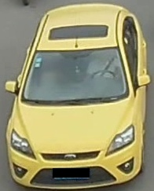
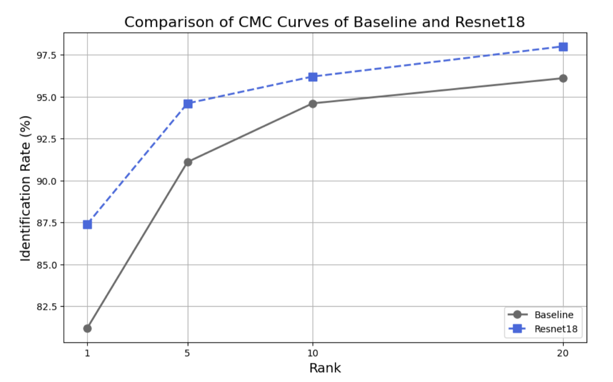
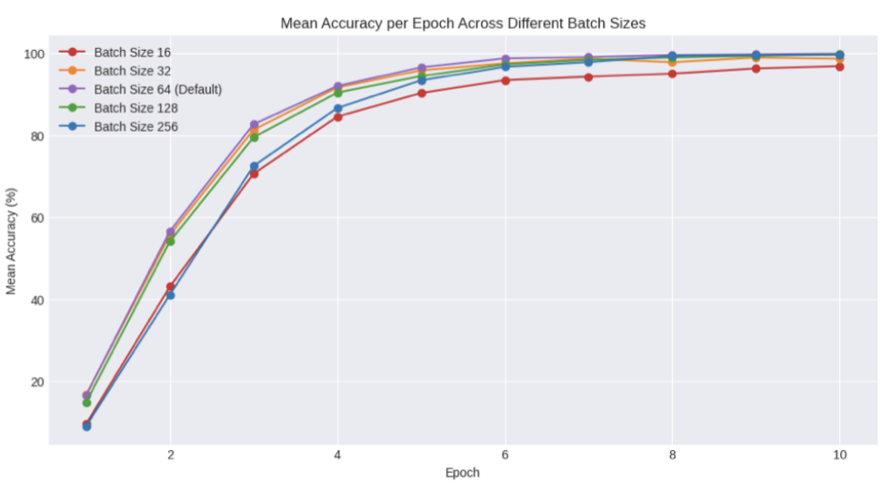

# Vehicle-ReIdentification

Implementation and Performance analysis for Different DL models and Hyperparameter exploration on the Veri Dataset for Vehicle Re-Id project.

## Introduction
This project focuses on **Vehicle Re-Identification (Re-ID)**, a critical task in intelligent transportation systems and surveillance. The goal is to identify the same vehicle across multiple non-overlapping cameras, a challenging task due to variations in viewpoint, lighting, and occlusions. 

This project explores the performance of different deep learning models (MobileNet, ResNet, and Vision Transformers) on the **VeRi dataset**, with a focus on hyperparameter tuning and augmentation techniques to improve model accuracy. The key metrics used for evaluation are **mean Average Precision (mAP)** and **Rank-n accuracy**.

## Dataset
The **VeRi dataset** was used for this project, which contains:
- **50,000 images** of **776 vehicles**
- Images captured from **18 cameras** with varying viewpoints, lighting, and occlusions
- Annotations include vehicle ID, color, type, and spatio-temporal information

A sample of the dataset:
<table>
  <tr>
    <td></td>
    <td></td>
  </tr>
</table>

## Methodology
- The project involved exploring different architectures, including **MobileNet-v3-small**, **ResNet18**, **ResNet34**, and **Vision Transformers (ViT_b_16)**.
-  **Hyperparameter Tuning**: Conducted extensive experiments to optimize learning rates, batch sizes, and optimizers.
- **Data Augmentation**: Applied techniques like **Color Jitter**, **Random Erase**, **GaussianBlurr**, **RandomHorizontalFllip** and **Color Augmentation** to improve model generalization.
-  **Performance Evaluation**: Used **mAP** and **Rank-n accuracy** to evaluate model performance.

## Results
### Model Performance
The following table summarizes the performance of different models:

| Model               | mAP   | Rank-1 | Rank-5 | Rank-10 |
|---------------------|-------|--------|--------|---------|
| MobileNet-v3-small  | 44.7% | 81.2%  | 91.1%  | 94.6%   |
| ResNet18            | 58.5% | 87.4%  | 94.6%  | 96.2%   |
| ResNet34            | 48.5% | 80.5%  | 91.7%  | 94.6%   |
| ViT_B_16            | 66.3% | 91.8%  | 96.2%  | 97.5%   |

*Table 1: Performance comparison of different models.*

### Hyperparameter Exploration
- **Learning Rate**: The optimal learning rate for ResNet18 was found to be **0.00035**, which improved mAP to **58.5%**. And learning rate of 0.00003 proved to be optimal for ViT.
- **Batch Size**: A batch size of **64** provided the best balance between training stability and performance.
- **Data Augmentation**: Combining **Color Jitter**, **Random Erase**, and **Color Augmentation** improved mAP to **58.0%** for the ResNet-18 Model.

<table>
  <tr>
    <td></td>
    <td></td>
  </tr>
</table> 

## References
1. Zakria, Deng, J., Hao, Y., Khokhar, M. S., Kumar, R., Cai, J., ... Aftab, M. U. (2021). Trends in vehicle re-identification past, present, and future: A comprehensive review. Retrieved from [link].
2. Krizhevsky, A., Sutskever, I., & Hinton, G. E. (2012). ImageNet classification with deep convolutional neural networks. Retrieved from [link].
3. Zhong, Z., Zheng, L., Kang, G., Li, S., & Yang, Y. (2020). Random erasing data augmentation. In *Proceedings of the AAAI Conference on Artificial Intelligence*.